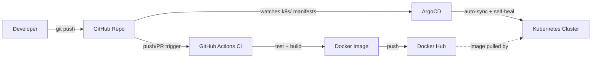

# GitOps Demo Service (Java / Spring Boot)


An end-to-end GitOps deployment pipeline for a containerized Spring Boot microservice, built to demonstrate DevOps skills: containerization, Kubernetes, CI, and GitOps continuous delivery with ArgoCD.

## Stack

- **Language/Framework:** Java 21, Spring Boot 3 (Web + Actuator)
- **Build tool:** Maven
- **Container:** Multi-stage Docker build (Maven build stage → Alpine JRE runtime, non-root user)
- **Orchestration:** Kubernetes (Deployment, Service, rolling updates, health probes)
- **CI:** GitHub Actions (test → build → push versioned image to Docker Hub)
- **CD:** ArgoCD (auto-sync + self-heal from Git)

## Architecture



The key idea: **CI and CD are decoupled.** GitHub Actions only ever builds and publishes an image — it never touches the cluster. ArgoCD is solely responsible for reconciling the cluster to match what's declared in Git. The cluster state converges to Git, not the other way around.

## Project layout

```
.
├── src/                      # Spring Boot source
├── Dockerfile                # Multi-stage build
├── .github/workflows/ci.yml  # CI pipeline
├── k8s/                      # Kubernetes manifests (Deployment, Service, Kustomization)
└── argocd/application.yaml   # ArgoCD Application definition
```

## Prerequisites

Tested with:

- Java 21 (Temurin)
- Maven 3.9+
- Docker 24+
- kubectl 1.28+
- [kind](https://kind.sigs.k8s.io/) or [Minikube](https://minikube.sigs.k8s.io/)
- [GitHub CLI](https://cli.github.com/) (`gh`) — optional, used for issue/workflow management
- [ArgoCD CLI](https://argo-cd.readthedocs.io/en/stable/cli_installation/) — optional, only needed for the CLI rollback commands below

This project runs entirely on a local cluster — no cloud account or spend required.

## 1. Run locally

```bash
mvn spring-boot:run
curl http://localhost:8080/api/hello
curl http://localhost:8080/actuator/health
```

## 2. Build and run the container

```bash
docker build -t gitops-demo-service:local .
docker run -p 8080:8080 gitops-demo-service:local
```

## 3. Set up CI (GitHub Actions)

1. Push this repo to GitHub.
2. In the repo settings, add these secrets:
   - `DOCKERHUB_USERNAME`
   - `DOCKERHUB_TOKEN` (a Docker Hub access token, not your password)
3. Push to `main` — the workflow tests, builds, and pushes `your-user/gitops-demo-service:latest` and `:<git-sha>` to Docker Hub.

## 4. Spin up a local cluster (Kind or Minikube)

**Kind:**
```bash
kind create cluster --name gitops-demo
```

**Minikube:**
```bash
minikube start
```

## 5. Install ArgoCD

```bash
kubectl create namespace argocd
kubectl apply -n argocd -f https://raw.githubusercontent.com/argoproj/argo-cd/stable/manifests/install.yaml

# Port-forward the ArgoCD UI
kubectl port-forward svc/argocd-server -n argocd 8081:443
```

Get the initial admin password:
```bash
kubectl -n argocd get secret argocd-initial-admin-secret -o jsonpath="{.data.password}" | base64 -d
```

Log in at `https://localhost:8081` with username `admin`.

## 6. Point the manifests at your repo

Before applying anything, edit:

- `k8s/deployment.yaml` → replace `<YOUR_DOCKERHUB_USERNAME>` with your actual Docker Hub image path.
- `argocd/application.yaml` → replace `<YOUR_GITHUB_USERNAME>` with your GitHub username/repo.

Commit and push these changes.

## 7. Register the app with ArgoCD

```bash
kubectl apply -f argocd/application.yaml
```

ArgoCD will pull the manifests from `k8s/` in your Git repo, create the `gitops-demo` namespace (via `CreateNamespace=true` in the sync policy), and deploy the Deployment + Service. Because `syncPolicy.automated` is enabled, any future push to `k8s/` (e.g. bumping the image tag after a new CI build) is picked up automatically — no `kubectl apply` needed. `selfHeal: true` also means manual `kubectl edit` changes on the cluster get reverted back to match Git.

> **Note on RBAC:** on a local kind/minikube cluster, ArgoCD runs with full admin access via your kubeconfig context, so no extra RBAC setup is needed. On a real/shared cluster, scope ArgoCD's service account to only the namespaces/resources it should manage — don't run it cluster-admin in production.

## 8. Verify

```bash
kubectl get pods -n gitops-demo
kubectl port-forward svc/gitops-demo-service -n gitops-demo 8080:80
curl http://localhost:8080/api/hello
```

## 9. Trigger a full deployment end-to-end

This is the part that actually proves the pipeline works, not just that it's set up:

1. Make a small code change, e.g. edit the message in `HelloController.java`.
2. `git commit -am "feat: update greeting message" && git push origin main`
3. Watch CI build and push a new image: `gh run watch`
4. Note the new image tag (the commit SHA) from the Actions log or Docker Hub.
5. Bump the tag in `k8s/deployment.yaml` (`image: your-user/gitops-demo-service:<new-sha>`), commit, and push.
6. Watch ArgoCD pick it up: `argocd app get gitops-demo-service --refresh` or watch the UI — it moves to `OutOfSync` then back to `Synced` within its poll interval (default ~3 min, or force it with `argocd app sync gitops-demo-service`).
7. Confirm the rollout: `kubectl rollout status deployment/gitops-demo-service -n gitops-demo`, then `curl` the endpoint again to see the new response.

## Rollback

If a bad deploy makes it through:

```bash
# Roll back via ArgoCD to the previous synced Git revision
argocd app rollback gitops-demo-service

# Or, cluster-side, roll back the Deployment directly
kubectl rollout undo deployment/gitops-demo-service -n gitops-demo
```

Note that a `kubectl rollout undo` is exactly the kind of drift `selfHeal: true` will revert — treat it as a stopgap, and follow up with a real revert commit in Git so the two stay in sync.

## Troubleshooting

- **`Error: Username and password required` in `docker/login-action`** — `DOCKERHUB_USERNAME`/`DOCKERHUB_TOKEN` secrets aren't set on the repo, or are empty. Set them via `gh secret set DOCKERHUB_USERNAME` / `gh secret set DOCKERHUB_TOKEN` (omit `--body` so the value isn't echoed or saved to shell history).
- **ArgoCD app stuck `OutOfSync`** — usually means the live cluster state has drifted from Git (a manual `kubectl edit`), or the image tag in `k8s/deployment.yaml` doesn't exist on Docker Hub yet. Check `argocd app diff gitops-demo-service`.
- **Pods stuck in `CrashLoopBackOff` right after deploy** — check the startup probe is giving the app enough time: `kubectl describe pod <pod> -n gitops-demo` and `kubectl logs <pod> -n gitops-demo`. Cold JVM start can occasionally exceed the default `startupProbe.failureThreshold * periodSeconds` window on a slow machine — increase `failureThreshold` if so.
- **`could not create workflow dispatch event: Workflow does not have 'workflow_dispatch' trigger`** — the workflow only runs on `push`/`pull_request`. Either push a real commit, or add `workflow_dispatch: {}` under `on:` in `ci.yml` to allow manual runs via `gh workflow run ci.yml`.
- **`gh issue create` fails with `could not add label: 'X' not found`** — custom labels (`java`, `docker`, `kubernetes`, `ci`, `argocd`, `docs`) must exist before use: `gh label create "docker" --color "0db7ed"`.

## Talking points for a "building in public" write-up

- Multi-stage Docker build keeps the runtime image lean and drops build tooling (Maven, JDK compiler) from the final image.
- Non-root container user reduces the blast radius of a container escape.
- Startup/liveness/readiness probes wired to Spring Boot Actuator give Kubernetes an accurate signal of app health, enabling safe rolling updates.
- CI is decoupled from CD: GitHub Actions only builds and publishes an image; ArgoCD is solely responsible for getting that image running in the cluster, watching Git as the single source of truth.
- `selfHeal` + `prune` demonstrate real GitOps semantics: the cluster state converges to Git state, not the other way around.

## Roadmap

- [ ] Auto-commit the new image tag from CI back into `k8s/deployment.yaml` (currently a manual step — see step 9 above), closing the loop fully.
- [ ] Package manifests as a Helm chart instead of raw YAML/Kustomize.
- [ ] Add Prometheus + Grafana for observability (Actuator already exposes `/actuator/health`, `/actuator/info` — extend with `/actuator/prometheus`).
- [ ] Add a staging ArgoCD Application tracking `env/dev` alongside the production one tracking `main`.

## License

MIT — see [LICENSE](LICENSE).